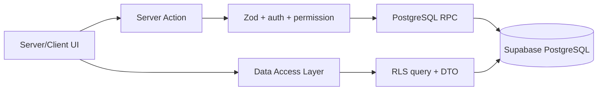

# Kiến trúc npp.sale v3

## Mục tiêu

v3 là modular monolith, không phải tập hợp microservice. Mọi module chạy trong
một Next.js deployment và một PostgreSQL/Supabase project để giữ giao dịch
nghiệp vụ atomic. Biên module nằm trong source code, DTO và RPC contract.

## Luồng dữ liệu chuẩn



Quy tắc:

1. Server Component không query bảng trực tiếp; đọc qua DAL và chỉ nhận DTO cần
   cho màn hình.
2. Mutation nhiều bước chỉ đi qua RPC. Server Action xác minh JWT, quyền và shape
   input; PostgreSQL xác minh lại org/role và khóa dòng.
3. Client Supabase chỉ dùng cho Realtime, barcode/QR và optimistic UI có giới
   hạn. Client không tự chuyển workflow hoặc tự ghi nhiều bảng.
4. RLS là hàng rào tenant thật; `proxy.ts` chỉ refresh session và redirect sớm.
5. `getClaims()` dùng để xác minh identity. `getSession()` không được dùng làm
   quyết định authorization ở server.

## Cấu trúc source

```text
src/
  app/                     route, layout, error/loading boundary
  components/              UI dùng chung, không chứa luật nghiệp vụ
  data/                    generated database types
  lib/                     hạ tầng: env, Supabase, HTTP
  modules/
    <module>/
      domain/              luật thuần, không Next/Supabase
      application/         use case, Server Action, RPC contract
      data/                DAL/repository server-only
      ui/                  component riêng của module
supabase/migrations/       transaction, RLS, index, RPC
```

## Ranh giới module

| Module | Sở hữu |
|---|---|
| identity | user, role, session, tenant context |
| permissions | role permission + user override |
| catalog | customer, supplier, product, UOM, price |
| orders | order, line, approval, merge, activity |
| inventory | batch, stock entry, FIFO/FEFO, stocktake |
| fulfillment | delivery, handover, swap, POD |
| finance | receivable, payment, cash receipt, expense |
| purchasing | PO, purchase invoice, payable, supplier return |
| workforce | attendance, payroll, commission, PJP/visit |
| reporting | aggregate RPC, export, drill-down |

## Kiểu dữ liệu

- VND: PostgreSQL `numeric(14,0)`; domain dùng `bigint` hoặc chuỗi integer. Không
  dùng số thực JavaScript để cộng tiền.
- Số lượng: PostgreSQL `numeric(12,2)`; domain dùng Decimal. Mọi dòng chứng từ lưu
  transaction quantity, unit, conversion snapshot và base quantity.
- Thời gian nghiệp vụ báo cáo phải khai báo rõ timezone; không trộn biên UTC và
  `Asia/Bangkok` nếu chưa có test characterization.

## Cache

Dữ liệu tồn kho, đơn, công nợ và quyền là volatile, mặc định không cache dùng
chung giữa người dùng. Cache Components chỉ dùng cho catalog/config đã scope org
và phải có cache tag chứa `org_id`. Mutation cần read-your-own-writes dùng
`updateTag`; không dùng stale cache cho bước giao dịch.

## Mức kiểm thử

- Unit: state machine, edit policy, UOM/money, permission precedence.
- RPC contract: payload Zod khớp chữ ký SQL.
- PostgreSQL integration: rollback, idempotency, concurrency, cross-org denial.
- E2E: đường ray tự giao và tài xế trên desktop/mobile.
- Golden Master: báo cáo v2/v3 khớp dữ liệu thật trước cutover.
